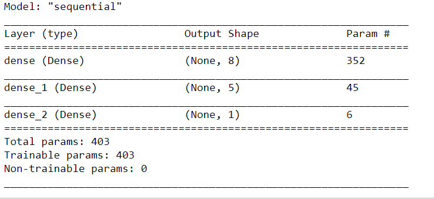
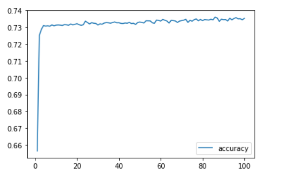
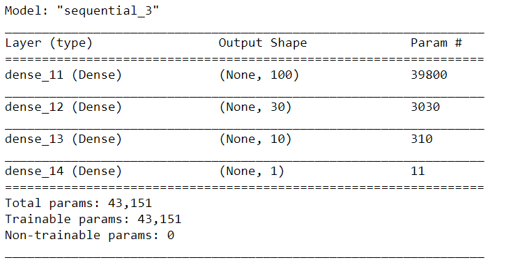
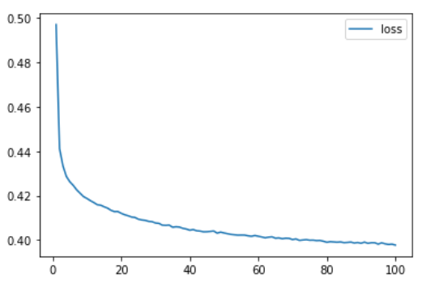

# Charity Analysis - Neural Nets and Deep Learning

## Objective
Using my knowledge of machine learning and neural networks, I will use the features in the provided dataset to create a binary classifier that is capable of predicting whether applicants will be successful if funded by Alphabet Soup.  

## Technologies Used
- TensorFlow: https://www.tensorflow.org/
- scikit-learn: https://scikit-learn.org/stable/getting_started.html

## Background

Using my knowledge of TensorFlow, I will design a neural network, or deep learning model, to create a binary classification model that can predict if an Alphabet Soup–funded organization will be successful based on the features in the dataset. I will need to think about how many inputs there are before determining the number of neurons and layers in your model. Once completed I will compile, train, and evaluate my binary classification model to calculate the model’s loss and accuracy.

I will also optimize my model in order to achieve a target predictive accuracy higher than 75% by using any or all of the following:

Adjusting the input data to ensure that there are no variables or outliers that are causing confusion in the model, such as:

- Dropping more or fewer columns.
- Creating more bins for rare occurrences in columns.
- Increasing or decreasing the number of values for each bin.
- Adding more neurons to a hidden layer.
- Adding more hidden layers.
- Using different activation functions for the hidden layers.
- Adding or reducing the number of epochs to the training regimen.

## Data

From Alphabet Soup’s business team, I received a CSV containing more than 34,000 organizations that have received funding from Alphabet Soup over the years.

Within this dataset are a number of columns that capture metadata about each organization, such as the following:

- EIN and NAME—Identification columns
- APPLICATION_TYPE—Alphabet Soup application type
- AFFILIATION—Affiliated sector of industry
- CLASSIFICATION—Government organization classification
- USE_CASE—Use case for funding
- ORGANIZATION—Organization type
- STATUS—Active status
- INCOME_AMT—Income classification
- SPECIAL_CONSIDERATIONS—Special consideration for application
- ASK_AMT—Funding amount requested
- IS_SUCCESSFUL—Was the money used effectively

### Data Cleaning

First, I dropped the EIN and NAME columns.
I determined the number of unique values for each column. For those columns that have more than 10 unique values, I determined the number of data points for each unique value.

I then created a density plot to determine the distribution of the column values. I used the density plot to create a cutoff point to bin "rare" categorical variables together in a new column, Other, and then check if the binning was successful. 

__Application Type__

For Application Type, I tried combining all types below 500 as "Other", and I also tried a different cutoff of 700.

For Classification, I combined all categories below 1000. 

I generated a list of categorical variables. I encoded categorical variables using one-hot encoding, and placed the variables in a new DataFrame. I finally merged the one-hot encoding DataFrame with the original DataFrame, and dropped the originals.

To complete the processing, I scaled the data to eliminate disparities in the feature ranges.

## Model Building and Results
After data preparation, my data consisted of 34,299 rows and 43 columns. I then performed a 75%/25% train/test split ratio, stratefied by our target.

I followed the following steps:

- Create a neural network model by assigning the number of input features and nodes for each layer using Tensorflow Keras.
- Create the first hidden layer and choose an appropriate activation function.
- If necessary, add a second hidden layer with an appropriate activation function.
- Create an output layer with an appropriate activation function.
- Check the structure of the model.
- Compile and train the model.
- Create a callback that saves the model's weights every 5 epochs.
- Evaluate the model using the test data to determine the loss and accuracy.
- Save and export your results to an HDF5 file

This model only had an accuracy on the testing set of 73%. I had a target of 75%. 

__Model Optimization__

Optimize a model in order to achieve a target predictive accuracy higher than 75% by using any or all of the following:

- Adjusting the input data to ensure that there are no variables or outliers that are causing confusion in the model, such as:
- Dropping more or fewer columns.
- Creating more bins for rare occurrences in columns.
- Increasing or decreasing the number of values for each bin.
- Adding more neurons to a hidden layer.
- Adding more hidden layers.
- Using different activation functions for the hidden layers.
- Adding or reducing the number of epochs to the training regimen.

For my final optimized model, I used the Name of the donor as a feature in the model. Any donor with less than 5 donations was classified as "Other". This limited the unique donors to around 300. Although this would typically be too many to one-hot encode, the neural net can handle a wide dataset - so I encoded them anyway.

My new model had 394 input features, most of them being the encoded name.

I further added a third hidden layer and increased the number of nodes per layer by 10x. Finally, I used the sigmoid activation function in my inner layers as opposed to ReLU.

This model achieved a 78.8% accuracy score on the testing set - which is over the target of 75%. 

For completeness, I also created a Random Forest, which is a quicker and simpler model. This random forest, trained on the same data as the neural net, achieved an accuracy score of 77% - similar to the neural net and above our target.

## Summary and Recommendation

If accuracy is not the main target, then perhaps the neural net overcomplicated the problem and a random forest would work in production.

Further, it seems who the donor is actually plays a part in if their donations is used successfully. This could mean that new donors, or first-time donors, might be under-predicted without more data on who they are. It's dangerous using this as a feature

I would recommend that AlphabetSoup uses the neural net as accuracy is the main objective.
Further work needs to be done to see if this complexity vs accuracy is an acceptible trade-off at the executive level.

## Limitations
There were a few limitations that came across in the exploration of this dataset. First, the dataset had too few rows for a neural net, at around 30,000. More data would help the model. Further, using the names as a feature is dangerous when predicting the outcome from new donors. 

## Future Work
In the future, it would be useful to expand the data by acquiring more historical record. Removing the name feature while maintaining accuracy is also preferred.

Verifying with the executive team on an acceptable trade-off between accuracy and complexity is necessary before productionalizing any model.